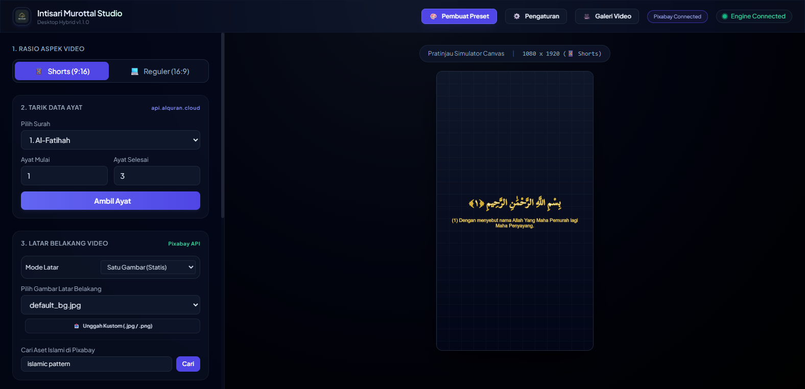
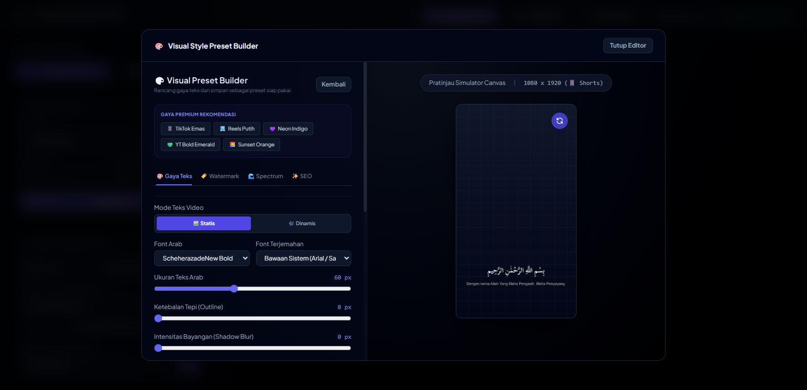
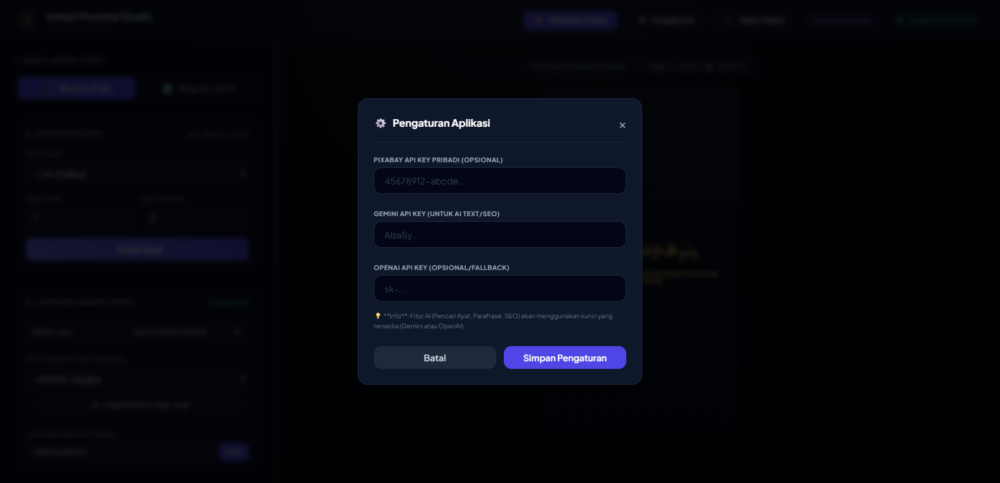

# 🌙 Intisari Murottal Studio

**Intisari Murottal Studio** adalah perangkat lunak *Desktop Hybrid* revolusioner yang dirancang khusus untuk memproduksi video lantunan ayat suci Al-Qur'an secara instan, aman dari hak cipta (*copyright-free*), dan memiliki akurasi tipografi Arab yang sangat tinggi.

Aplikasi ini menggabungkan antarmuka modern berbasi web (*Tailwind CSS & JavaScript*) dengan mesin pemroses lokal yang kuat (*Python FastAPI, FFmpeg, ImageMagick*), memberikan Anda pengalaman rendering setingkat studio langsung di PC Anda.

---

## ✨ Fitur Utama

### 1. 🎛️ Simulator Canvas Live (Pratinjau Akurat)
Anda tidak perlu lagi menebak-nebak hasil akhir video. Simulator *Canvas* memberikan pratinjau *Real-Time* dari rasio aspek video (Shorts 9:16 atau Reguler 16:9), posisi teks Arab, terjemahan, serta pemotongan (*cropping*) gambar latar belakang.

### 2. 📖 Pengambil Ayat Otomatis (Alquran Cloud API)
Ketik surah dan rentang ayat yang Anda inginkan, aplikasi akan secara otomatis mengambil teks Arab (dengan harakat lengkap yang akurat) dan terjemahannya. Teks Arab dirender menggunakan *ImageMagick* secara *pixel-perfect* tanpa masalah ligatur yang sering terjadi pada video editor biasa.

### 3. 🎨 Preset Premium (Cinematic & Minimalis)
Murottal Studio dilengkapi dengan sistem **Preset Builder**. Anda dapat menyimpan atau menerapkan gaya desain hanya dengan satu klik!
Preset mencakup:
- Pemilihan Font (Arab & Latin).
- Warna Teks, Ukuran, & Spasi.
- **Efek Shadow Blur** untuk teks agar tetap terbaca jelas di background terang.
- **Dimmer Latar Belakang (Opacity & Color)** untuk memberikan kesan *Cinematic*.

### 4. 🏞️ Integrasi Aset Hak Cipta Bebas (Pixabay)
Aplikasi terhubung langsung ke API Pixabay. Anda dapat mencari jutaan gambar Islami (seperti arsitektur masjid, pemandangan alam, pola geometris) langsung dari dalam aplikasi dan menerapkannya sebagai latar belakang video.

### 5. 🎞️ Mesin Render FFmpeg Ultra-Cepat
Berkat mesin render latar belakang berbasis *FFmpeg*, video 1080p dapat disatukan dari gambar statis, audio Murottal, teks berlapis (*overlay*), dan efek transisi (jika menggunakan multi-gambar) dalam waktu yang jauh lebih cepat daripada menggunakan NLE konvensional (seperti Premiere atau CapCut).

### 6. ⚙️ Manajemen Pengaturan & Lisensi Pintar
Anda dapat mengatur *Path* khusus untuk folder penyimpanan, mengatur kualitas Output, dan mengintegrasikan akun lisensi (*Cloudflare License Validator*).

### 7. 🚀 Pembaruan Otomatis (Auto-Updater)
Murottal Studio dilengkapi dengan sistem *Auto-Updater*. Setiap kali ada rilis fitur baru, aplikasi akan memberikan pemberitahuan secara elegan, mengunduh pembaruan di latar belakang, dan memasang ulang dirinya sendiri tanpa campur tangan teknis dari pengguna.

---

## 🛠️ Arsitektur Teknologi
- **Frontend**: HTML5, Vanilla JavaScript, Tailwind CSS (Antarmuka *Glassmorphism* Elegan).
- **Backend / API**: FastAPI (Python).
- **Desktop Container**: PyWebView (Menjalankan Edge Chromium WebView2).
- **Core Engine**: FFmpeg (Video/Audio Muxing) & ImageMagick (Text Rendering).
- **Distribusi**: PyInstaller & Inno Setup.

## 📥 Cara Penggunaan
1. Buka aplikasi. Pilih **Rasio Aspek** (Shorts / Reguler).
2. Pilih Surah dan Ayat, lalu klik **Ambil Ayat**.
3. Cari latar belakang dari **Pixabay** atau unggah milik Anda sendiri.
4. Pilih audio murottal yang sesuai.
5. *(Opsional)* Terapkan **Preset Premium** melalui tombol di sudut kanan atas.
6. Klik **Mulai Render**. Video Anda siap diunggah ke YouTube, TikTok, atau Instagram!

---

*Dikembangkan untuk kebaikan umat. Semoga menjadi amal jariyah.*
